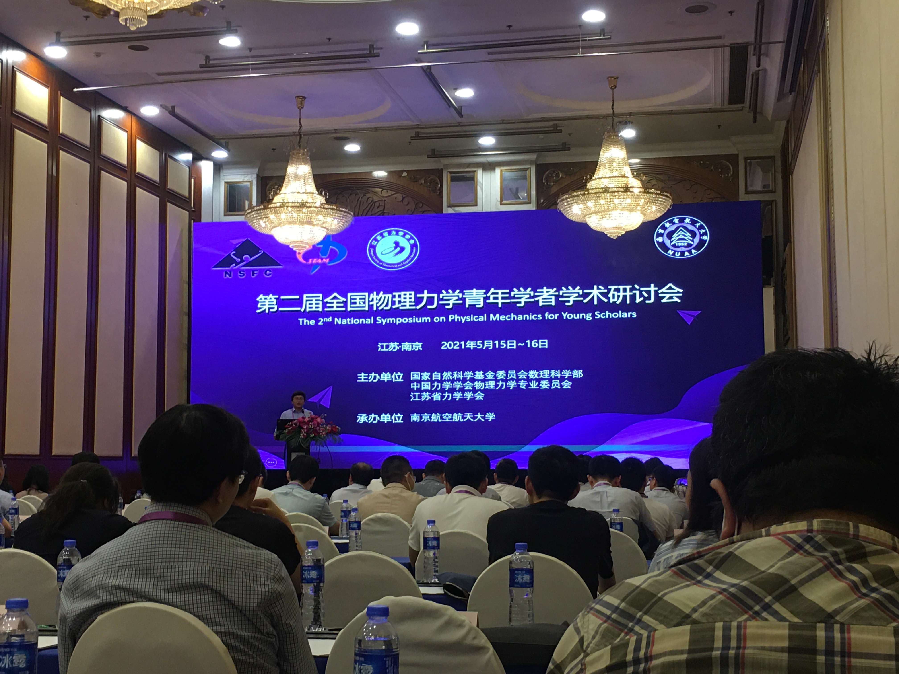
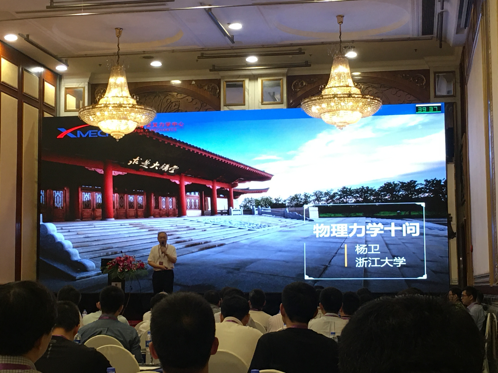
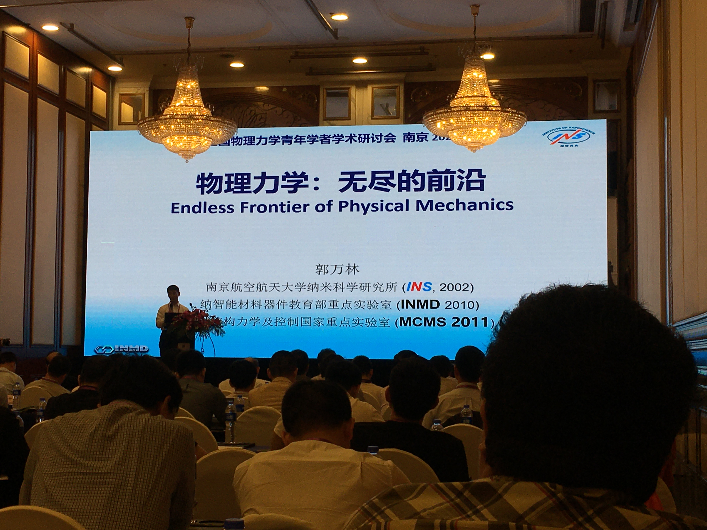
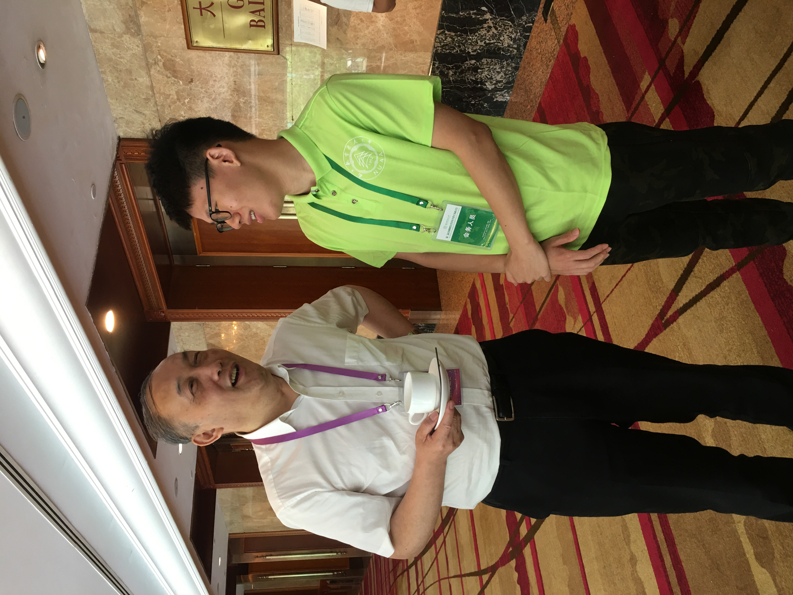
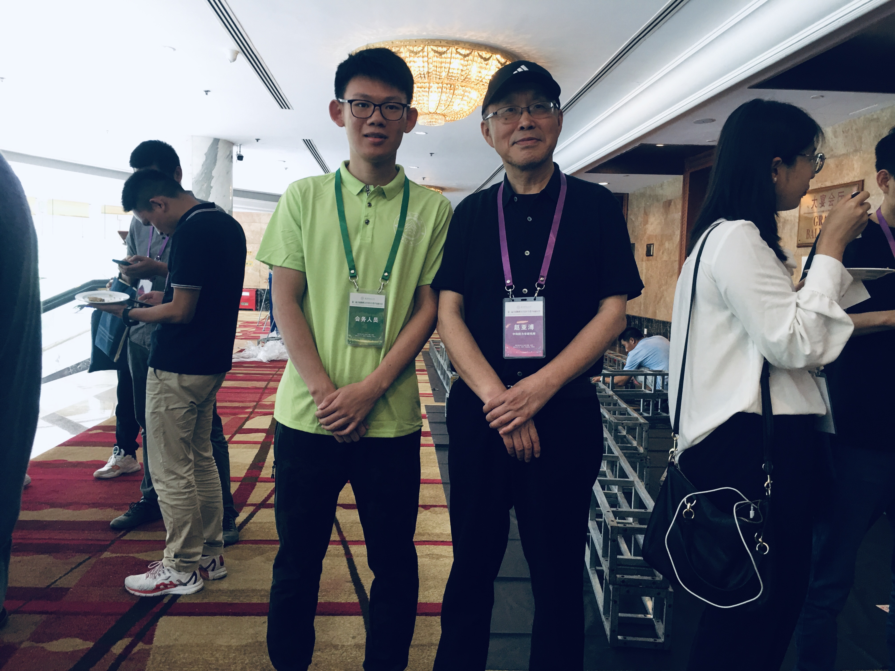

## Overview

In May 15th - 16th, 2021, I took part in the 2nd National Symposium on Physical Mechanics for Young Scholars as a conference staff. In this conference, I learnt some recent progressein the field of physical mechanics. 

Having a picture with Prof. Wei Yang:

Having a picture with Prof. Yafu Zhao:

