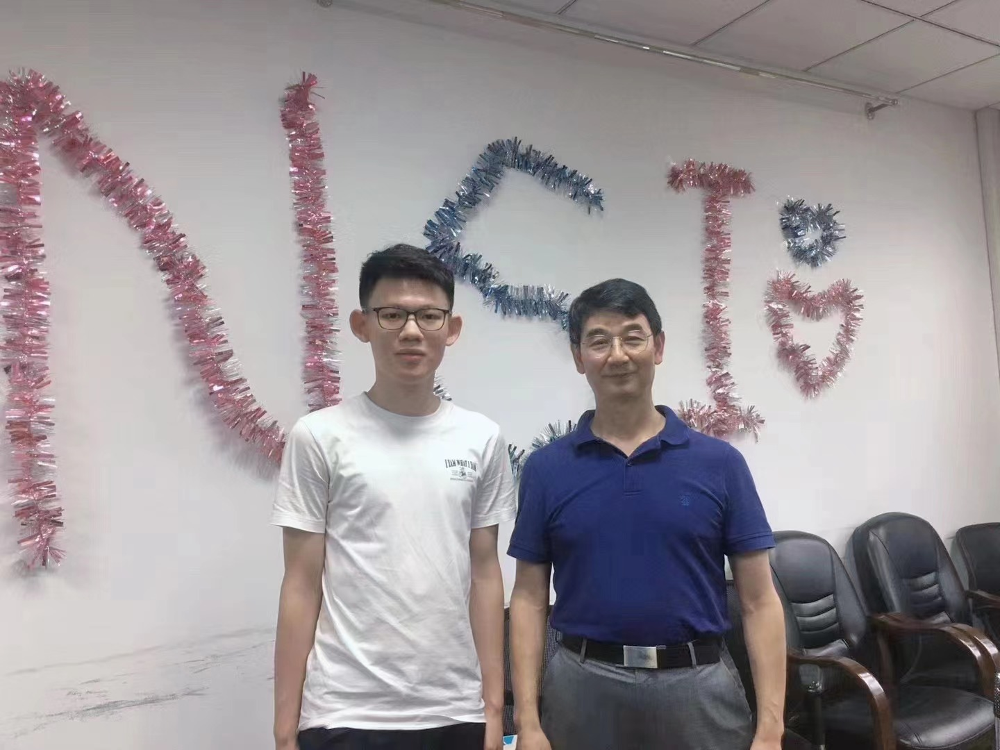
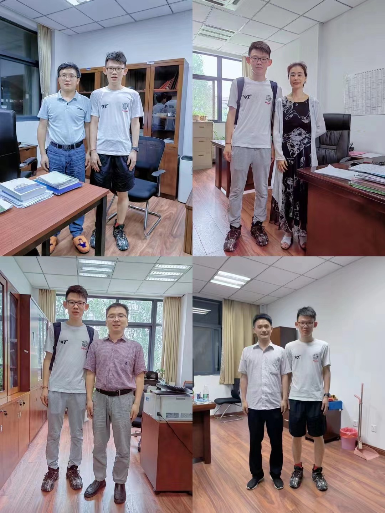
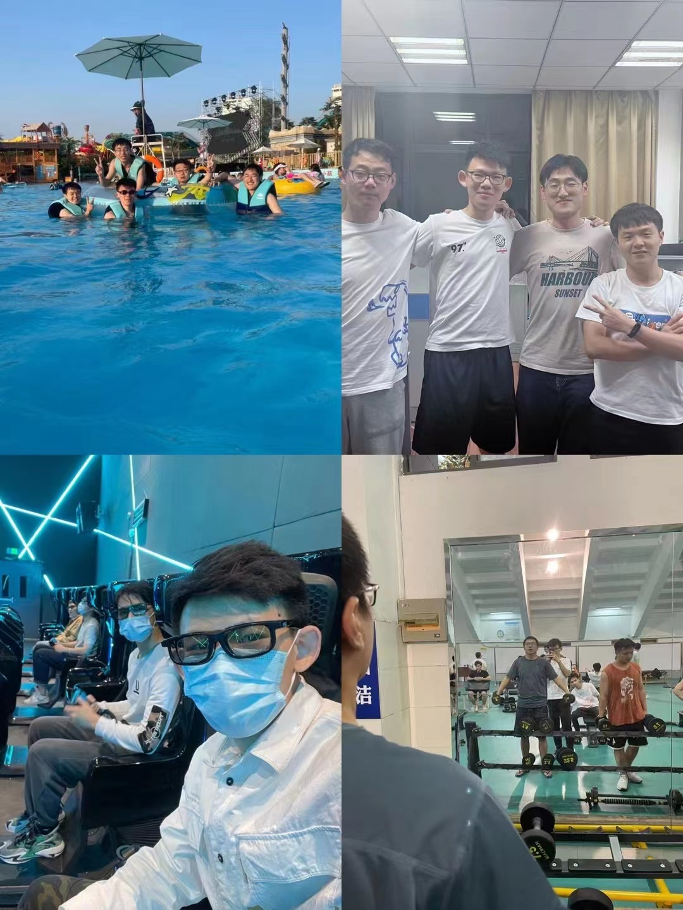

After nearly two years working in the Institute of Nano Science, I decide to leave and head for my next step. I really appreciate the help from my advisor, Prof. Wanlin Guo. He is one of the best teachers I have ever met. Also, I want to thanks the help and appreciations from [Prof. Min Yi](https://scholar.google.com/citations?user=fhdZx6sAAAAJ&hl=en), [Prof. Hu Qiu](https://scholar.google.com/citations?hl=en&user=NlVmmpgAAAAJ), [Prof. Zhuhua Zhang](https://scholar.google.com/citations?hl=en&user=RA5pOAgAAAAJ) and lecturer Qing Wang. Importantly, I want to thanks the  accompany of my buddies. Hope you all will have a very bright future!  

