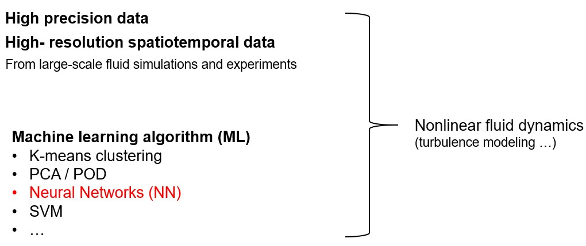
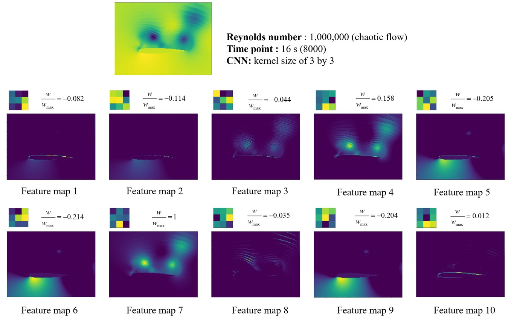
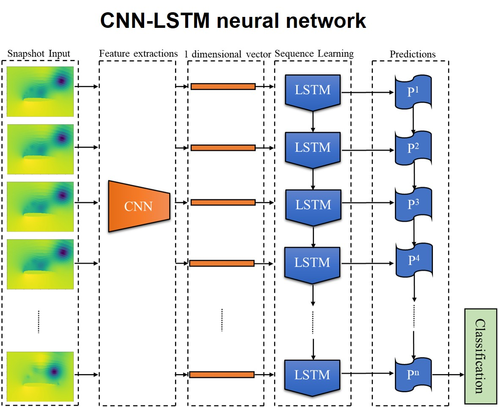
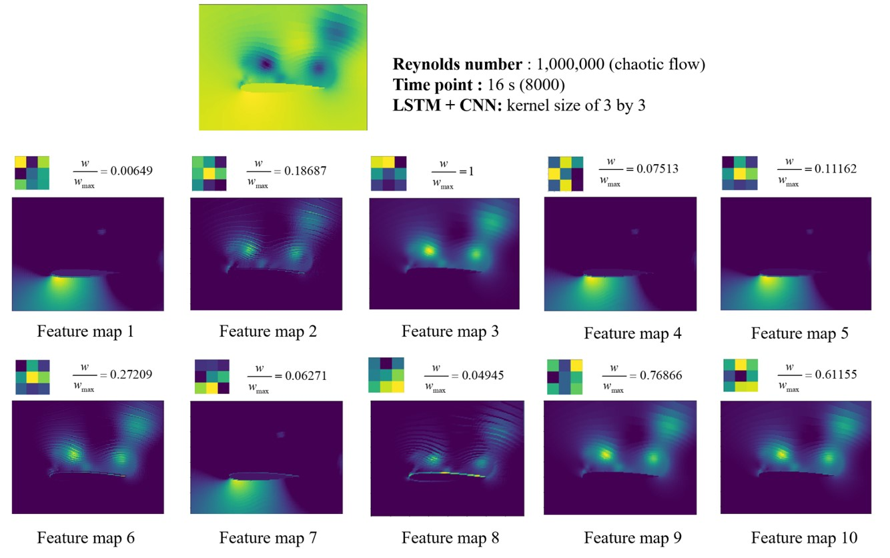
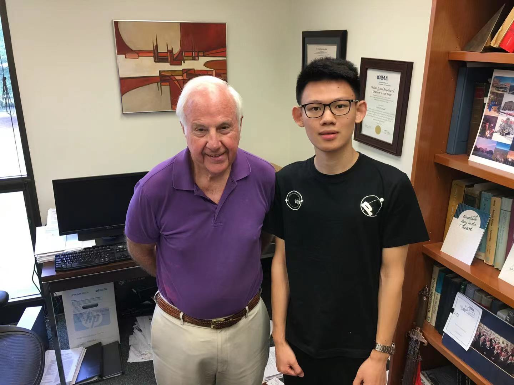
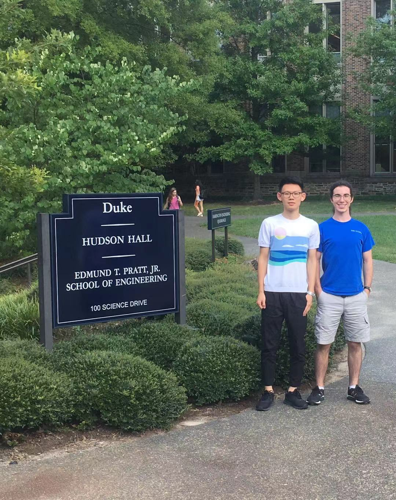

In recent years, due to the development of high-performance computations and experimental measurement capabilities. Researchers are able to obtain high precision and high-resolution spatiotemporal data from large-scale fluid simulations and experiments.

At the same time, the advancement of sophisticated algorithms and open source software enables researchers to apply ML to address many challenges. Among them, neural Networks is a powerful tool to simulate nonlinear mapping relationship. Therefore, in fluid mechanics community, turbulence modeling and more generally, nonlinear fluid dynamics has been one proving ground for neural networks. Recent advancements on ML-assisted fluids can see these reviews in Annual Review of Fluid Mechanics:

- [Turbulence modeling in the age of data](https://www.annualreviews.org/doi/10.1146/annurev-fluid-010518-040547)
- [Machine learning for fluid mechanics](https://www.annualreviews.org/doi/abs/10.1146/annurev-fluid-010719-060214)

Unsteady flows are high-dimensional, nonlinear and multiscale in nature. Understanding the complex flow physics relies on the extraction of main features known as coherent structures or modes. Coherent structures are characteristic and recurrent flow patterns that not only reveal the essential flow physics, but also provide subspaces to construct low-dimensional flow modes. Currently, flow modes can be extracted based on either energy or frequency, resulting in two main mode decomposition methods: Proper Orthogonal Decompostion (POD) and Dynamic Mode Decomposition (DMD). Details about mode decompostion can see this paper:

- [Modal Analysis of Fluid Flows: An overview](https://arc.aiaa.org/doi/10.2514/1.J056060)

In our work, we applied machine learning for pattern recognition to a subsonic airfoil experiencing buffet at a high incidence angle and a range of Reynolds numbers. While previous research has applied machine learning to nonlinear fluid flows, little attention has been paid to the coherent structures constructed as part of the neural network. In the context of subsonic buffet flows, this new focus is of particular value.

The significance of our work lies in the alignment of the learned flow patterns with existing theories on the dynamics of subsonic buffet flows. By extracting the convolutional kernels and corresponding feature maps, it was verified that the convolutional neural network employed in this research had identified large-scale coherent structures believed to drive the buffet phenomenon. The model was able to accomplish this feat without any provided kinematic, or even temporal, information.

Here, I did an animation to better help the reader understand the power of these kernels.

Next, we consider to introduce temporal information into the neural model so that it can compute characteristic time scales associated with these coherent structures. Here, we employed the CNN-LSTM neural network. And further insight is gained into the dynamics of the airfoil buffet. The LSTM architecture is good at processing the sequence input, like video. Here is the architecture of the neural network.

The resulting classification accuracy was also near-perfect. These figure shows kernels and their corresponding feature maps in the convolution layer for the trained model. Compared with figure before, it is clearly that the number of dynamically significant kernels increased when temporal information was considered. The edge and useless kernels, which had low ratios of weight in the CNN, disappeared entirely in the CNN-LSTM model. Therefore, with the inclusion of temporal information, the CNN-LSTM model employed only kernels which captured dynamically significant characteristics; no “edge” or “useless” kernels were constructed. But it should be noted that the CNN-LSTM involves solving within a much larger parameter space and therefore requires significantly more computational resources to train.

In summary, a convolutional neural network was trained for a simple identification task and the learned coherent structures used by the model for pattern recognition were then studied for dynamical significance. The coherent structures were found to align with current theories on the nature of high-incidence subsonic buffet flows. In our paper, we have more details to discuss, you can view this paper in my [Publications page](https://shizhengwen.netlify.app/publication/). Currently, this paper is under revision for publication.

This work was finished when I was a visiting student at Duke University in 2019 Fall, under the advisement of Prof.Earl Dowll and Michale W. Lee.

Here, Prof. Dowell recorded a testimonial video for me. He is the elected member of national academy of engineering and honorary fellow of AIAA. In 2016, he received the highest individual honor for achievement in aeronautics.

 <video src="./photo/dowellforshizheng.mp4" controls = "yes"></video>

