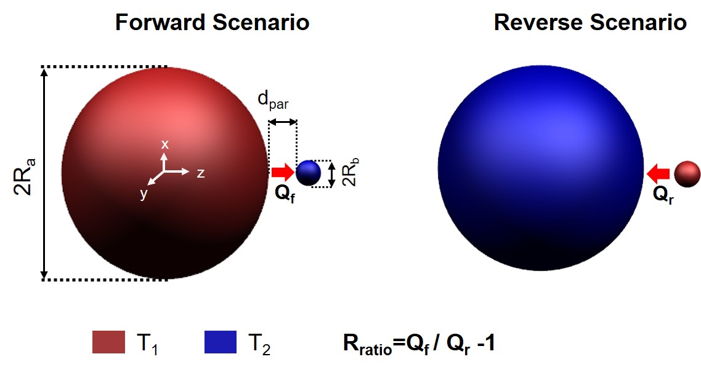
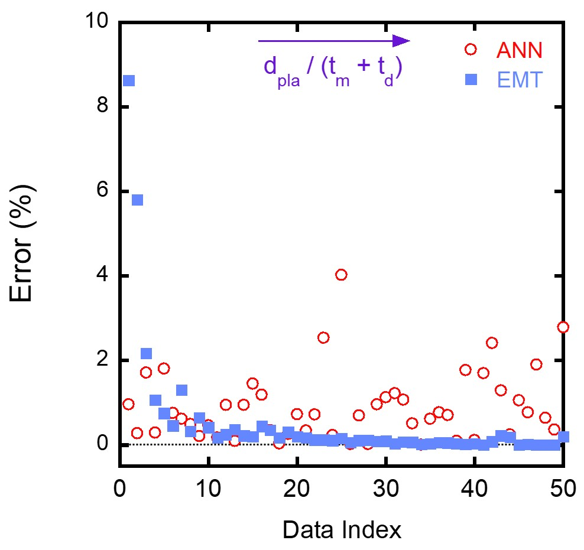

When the vacuum gap distance between two objects is comparable to or smaller than the characteristic wavelength of thermal radiation, near-field effects become significant in radiative heat transfer process. A plethora of researches have theoretically and experimentally investigated that the radiative heat exchange in the near field can surpass the limit governed by Stefan-Boltzmann law, as a result of tunneling of evanescent waves between two bodies. This is called “near-field radiative heat transfer (NFRHT) problem”.

Currently, NFRHT is facing two fatal obstacles. 

- Traditional methods for calculating near-field radiative heat transfer mainly include accurate scattering matrix theory based on Rigorous Coupled-Wave Analysis (RWCA) and Dyadic green's function. However, these accurate methods often require huge computational costs when calculating the NFRHT of complex structures. Otherwise, approximate solving algorithms including Effective Medium Theory (EMT) and Dipole Approximation (DA), although having high efficiency, can be accurate only when the characteristic length of the microstructure is related to the characteristic wavelength of radiation. Therefore, finding a better strategy incorporating merits of these two methods is very meaningful.
- Researchers in NFRHT community is always seeking for new materials/structures to further enhance the energy transfer rate by evoking corresponding evanescent modes. Such process of enhancing NFRHT is denoted by ‘direct design’. Although this method is considered feasible and can be solved via simulation, it very often relies on the intuition and expertise of the researcher, ultimately limiting the development of structure for desired radiative properties. Inverse design of system’s structures, i.e. obtaining geometric and physical parameter for the desired solution, has been a promising research focus for recent years.

In this work, by combining two data-driven ML methods, viz. artificial neural networks (ANNs) and genetic algorithms (GAs), we propose a flowchart for the modeling and optimal design of near-field thermal devices as shown in the head figure. The adopted workflow is enabled by the following innovative points: first, a sampling method based on Latin hypercube sampling (LHS) and sensitivity analysis (SA) is used for the design parameters of the problem to be studied. These sampled points are calculated with accurate NFRHT method so as to build our training dataset. Second, a surrogate ANN model was trained to construct a functional model from an input feature vector to a corresponding output feature vector, which can be used to predict the NFRHT and rectification ratio of corresponding structures. Finally, GA was applied to the surrogate ANN model to identify the optimal solution for the problem, based on emulating biological evolutionary theories. Detailed description and settings of ANN and GA for this research can see the supplementary material.

The errors of different testing structures predicted by ANN and effective medium theory (EMT) are shown in the following figure.

Currently, this paper was published by *Applied Physics Letters*. Additionally, this work is highly acknowledged by my advisor and helped me win the award of best undergraduate thesis (Top 1%). 

This work was started when I was still an undergraduate student at NUAA in 2020 Spring, under the advisement of Prof. Xianglei Liu. He is now the vice dean of College of Energy and Power Engineering. He won the Sigma Xi Best Ph.D. Thesis Award in Georgia Institute of Technology (TOP 2%),  Raymond Viskanta Young Scientist Award (1-2 people in the field of thermal radiation every year) and so on.
