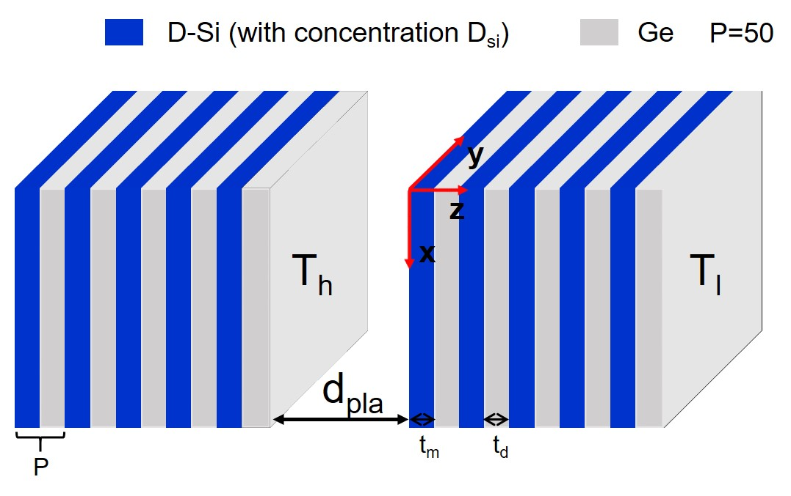

When the vacuum gap distance between two objects is comparable to or smaller than the characteristic wavelength of thermal radiation, near-field effects become significant in radiative heat transfer process. A plethora of researches have theoretically and experimentally investigated that the radiative heat exchange in the near field can surpass the limit governed by Stefan-Boltzmann law, as a result of tunneling of evanescent waves between two bodies. This is called “near-field radiative heat transfer (NFRHT) problem”.

Currently, NFRHT is facing two fatal obstacles. 

- Traditional methods for calculating near-field radiative heat transfer mainly include accurate scattering matrix theory based on Rigorous Coupled-Wave Analysis (RWCA) and Dyadic green's function. However, these accurate methods often require huge computational costs when calculating the NFRHT of complex structures. Otherwise, approximate solving algorithms including Effective Medium Theory (EMT) and Dipole Approximation (DA), although having high efficiency, can be accurate only when the characteristic length of the microstructure is related to the characteristic wavelength of radiation. Therefore, finding a better strategy incorporating merits of these two methods is very meaningful.
- Researchers in NFRHT community is always seeking for new materials/structures to further enhance the energy transfer rate by evoking corresponding evanescent modes. Such process of enhancing NFRHT is denoted by ‘direct design’. Although this method is considered feasible and can be solved via simulation, it very often relies on the intuition and expertise of the researcher, ultimately limiting the development of structure for desired radiative properties. Inverse design of system’s structures, i.e. obtaining geometric and physical parameter for the desired solution, has been a promising research focus for recent years.

In this research, by combing artificial neural network, we firstly built a surrogated model for calculating NFRHT. Our results show that both the accuracy and efficiency are very high for this surrogated model. Subsequently, we applied genetic algorithm in our surrogated model and quickly found the optimal parameters for the structure. A schematic of this general procedure can be found in the head picture. 

We considered two representative cases, enhancing the NFRHT between two multilayers and rectification ratio between two nanoparticles, to verify the generalization capability of our approach. __The amazing thing was that we have found some new physics in NFRHT by using our proposed approach.__

In the following figure, we compared the accuracy of ANN-surrogated (ANN) model with approximate solving algorithms named EMT. 

Currently, a research paper of this work is under preparation. This work is highly acknowledged by my advisor and helped me win the award of best undergraduate thesis (Top 1%). Hope you will look forward to it.

This work was started when I was still an undergraduate student at NUAA in 2020 Spring, under the advisement of Prof. Xianglei Liu. He is now the vice dean of College of Energy and Power Engineering. He won the Sigma Xi Best Ph.D. Thesis Award in Georgia Institute of Technology (TOP 2%),  Raymond Viskanta Young Scientist Award (1-2 people in the field of thermal radiation every year) and so on.
