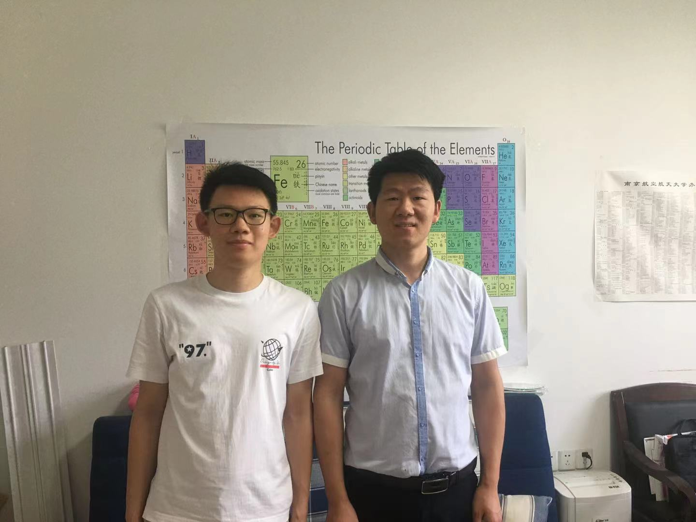

Thermal radiation is one of the most common phenomena in nature. Any object with a temperature greater than 0 K can spontaneously radiate electromagnetic waves (thermal radiation) all the time. In last century, when quantum mechanics was first established, people believed that the thermal emission of objects was governed by Planck's law at large scale, modified by the corresponding surface emissivity. 

However, in recent twenty years, experimental researchers have found that when the geometric dimension of object is comparable to the characteristic wavelength of thermal radiation, the resulting radiative energy exchange can greatly [exceed the limit set by Planck's blackbody law](https://physicsworld.com/a/exposing-the-flaw-in-plancks-law/). And this phenomena is what we called near-field radiative heat transfer.

Near-field radiative heat transfer has many promising applications  due to its high efficiency of energy transmission, including [near-field thermophotovoltaics](https://shizhengwen.netlify.app/publication/jqsrt_2020_ntpv/) and [thermal rectifiers](https://shizhengwen.netlify.app/publication/jqsrt_2019_thermal_rectifer/). Here, I want to talk you more about the thermal rectifiers.

As we all know, the development of modern electronics and information processing industries depends on the invention of electric diodes, which relies on the rectification of electrons flow. Nevertheless, due to the higher integration of circuits, the heat flux density has increased significantly. Subsequently, a high-temperature working condition may be resulted in, where electronic diodes tend to have low efficiency and even fail. On the other hand, heat flow can also be controlled, which may provide alternative ways to process information at harsh conditions. Thermal rectification is a phenomenon that allows heat flow in a more favorable direction. This phenomenon is promising to pave the way for the realization of future thermal diode/rectifier devices, even thermal computers, and thus is attracting extensive attention.

The performance of thermal rectifier can be characterized by the thermal rectification ratio as:

where Qf and Qr represent net heat fluxes in the forward and reverse scenarios, respectively.

As we all know, heat transfer can be realized by three approaches: conduction convection and radiation. Previous researches on thermal rectification were primarily based on conduction and convection. Alternatively, Radiation-based thermal diodes, which can avoid contact and intrusion, have been proposed. 

Although previous researches have been done on this field, radiation-based thermal rectifiers, as shown in this figure, still have a low rectification ratio compared with conduction-based counterparts, which can be as high as 100. Therefore, investigations on further improving the performance of radiation-based rectifiers are very imperative.

In order to cause the asymmetry for heat flux, the radiative properties of the material should be sensitive with the temperature. Here, I consider the intrinsic silicon as the material to construct the rectifier. According to semiconductor physics, radiative properties of silicon can be easily tailored by changing temperatures due to thermally excited carriers. See the following figures.

Therefore, when we constructed the thermal rectifier based on intrinsic Si and a dissimilar material. In the forward bias, electrons of Si will be excited at high temperatures, which gives rise to the enhancement of radiative heat transfer. In reverse bias, electrons won’t be excited, the heat transfer will be constrained. This asymmetry of heat flux will give rise to a high rectification ratio. And this is the key idea of this work. 

Further, effects of gap distances, materials and configurations of nanoparticles on the rectification ratio are also investigated. We use dipole approximation to unveil the underlying mechanisms. Details information can be viewed in our paper.

This work was finished when I was a junior student at NUAA in 2019 Spring, under the advisement of Prof. Xianglei Liu. He is now the vice dean of College of Energy and Power Engineering. He won the Sigma Xi Best Ph.D. Thesis Award in Georgia Institute of Technology (TOP 2%),  Raymond Viskanta Young Scientist Award (1-2 people in the field of thermal radiation every year) and so on. It should be noted that this work helped me won the highest honor for researching in NUAA.

Following are part comments from reviewers:

`In this paper, the authors proposed a high-performance thermal rectification approach based on the thermal effect of intrinsic and doped Si. The thermal rectification ratio can be enhanced to exceeding 10K, which is record-breaking. I found the results very interesting, and therefore recommend its acceptance after a minor revision.`

`In this work the authors described a thermal rectification mechanism between two different nanoparticles with respect to their separation distance. They highlight a high (potentially record) rectification coefficient both in near-field and in far field regime with a maximum of rectification in extreme near-field regime around 10nm and explain the physical origin of this strong rectification. The manuscript is pretty well written and the involved physical mechanisms are well described.`

