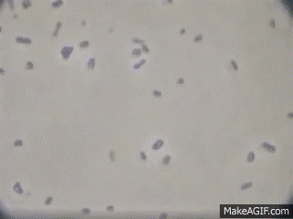
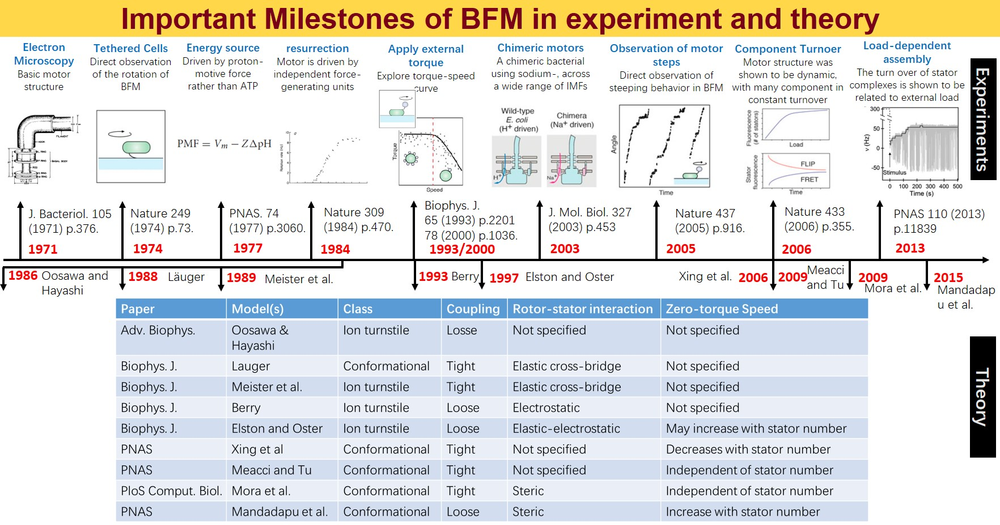
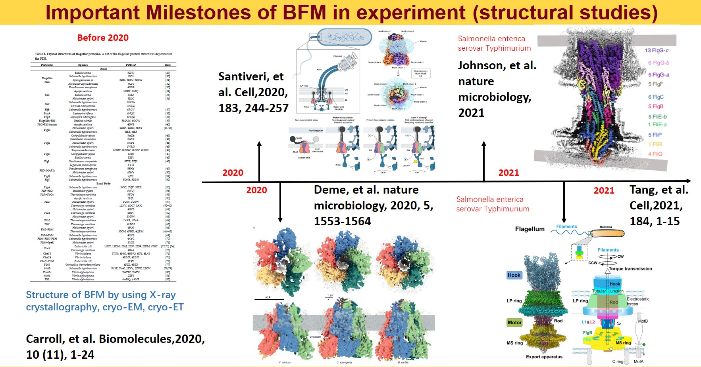
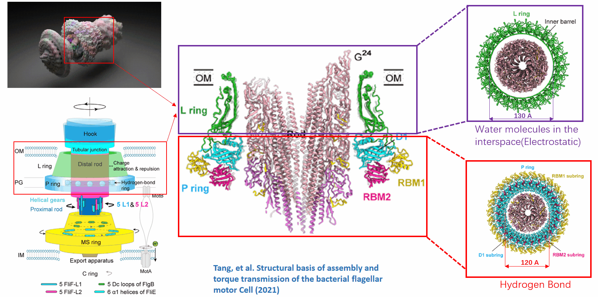

In our nature, there are many fascinating motor machines in biological systems. These motor machines can be divided into two parts: linear motors and rotary motors. Generally, linear motors including kinesin, dynein, myosin generate energy for locomotion by ATP hydrolysis. rotary motors including bacterial flagellar motor (BFM) and ATPase generate energy by the difference of concentration on both sides of the membrane. The protagonist in our project is bacterial flagellar motor. 

The first swimming bacterial cells were firstly observed by Leeuwenhoek in the seventheeth century. However, due to the reason that the bacterium is too small to observe by optical microscope, people didn't noticed the flagellar filament and spins of motor in the following 300 years. Until the mid-1900s, people started to notice the movement of flagellar motor.

Here, I summarized the important milestones of BFM in experiment and theory. If you are interested, you can read the references in this figure.

Although the bacterial flagellar motor has been studied early, for a long time, detailed modeling efforts have been stymied by the lack of atomic-level structural information. Before 2020, all studies related to structural analysis had been summarized in the review of Liu Jun's group at Yale. In 2020, two important papers that got the atom-level structural information of static in BFM has been published, which is important to help us understand how BFM transform the chemical gradient energy into mechanical energy. But this is not what we focus in this research project. In May 2021, flagellar basal body has been analyzed at the atomic accuracy by cryo-EM. And groups in Zhejiang University and Oxford nearly published their articles at the same time. And that is the motive of my project. I found this structure very intriguing and may exist some important mechanisms. Let's me further explain to you what I am thinking.

In the structure they revealed, I found a very interesting part. The basal body of the bacterial flagellum is a rotary motor that consists of several rings (C, MS and LP) and a rod. What makes this part amazing is that the LP ring acts as a bushing supporting the distal rod for its rapid and stable rotation without much friction. It should be noted that the maximum rotation speed has been measured to be 1700 revolutions per second (rps), which is much faster than that of the Aero Engine. It also should be noted that the rod is is asymmetric. However, under these circumstances, the system is very stable and can convert the electrochemical potential difference of cations across the cell membrane to mechanical work with almost 100% efficiency. So amazing! Isn't it?

This question can be viewed as a problem of liquid-solid and solid-solid interface. According to their paper: 

- the outer surface of the rod and inner surface of the L ring form a small gap between them that is large enough  (~ 6 - 7 Angstrom)  to accommodate one or two layers of water molecules. These water molecules is highly confined and have the different properties comparing with bulk water. This is a liquid-solid interface. 
- the distance between outer surface of the rod and inner surface of the P ring is much smaller. The narrowest part will reach 2-3 Angstrom, and this is a solid-solid interface.

Therefore, I am trying to figure out the potential mechanism of this question. I think this problem is very meaningful, which can guide us design super-lubricant interface. What's more, I think it may also tell us how microorganism not only interact with the environment but even control the the environment!

Currently, I have two ideas about how deal with this question:

- Firstly, I am trying to run the all-atom molecular dynamics simulation for the whole system. And I already have some results of equilibrium. I will show you in the following. But this path is facing some obstacles now. Due to reason that the whole system is very large (about 2 million atoms), we cannot get a long enough simulation to analyze. You should know that time scale of microsecond is needed, but our hardware can only support us to reach the time scale of nanosecond. I am thinking whether I can accelerate my simulation by using machine learning.
- Secondly, I am thinking if I can build a model from the perspective of thermodynamics. Due to the energy scale of the biological motor is comparable to the energy of thermal fluctuation in the environment. Therefore, I am thinking if there is a possibility that the motor can make use of the energy of thermal fluctuation and counteract the friction. I think I can use a simple and abstract model to verify this concept, which is much more innovative and time-saving. 

Following are some of results of our simulation. Because this work is still on the march, I can't post more details. Please look forward to our future paper!

This work is totally proposed by myself. And is highly acknowledged by my current supervisor Prof. Wanlin Guo, Prof. Min Yi and Prof. Hu Qiu. Professor Guo is Academician of Chinese Academy of Sciences and the founder and director of Institute of Nanoscience. Prof. Yi is the recipient of the 15th Thousand Youth Talents Program of China. Professor Qiu is the full professor of NUAA.

I have also contacted the first author of the structure analysis paper [(Cell)](https://www.sciencedirect.com/science/article/abs/pii/S009286742100430X) by Zhejiang University, they gave me their huge interest and high recognition about my idea. 

